## Capstone Project: Shell Script for AWS IAM Management

### CloudOps Solutions is a growing company using AWS to manage its cloud infrastructure. To support scaling, they aim to automate IAM tasks such as user creation, group management, and permission assignments, especially for their DevOps team. This project enhances the `aws_cloud_manager.sh` script to streamline these processes efficiently.

Lets proceed to deliver this project. 

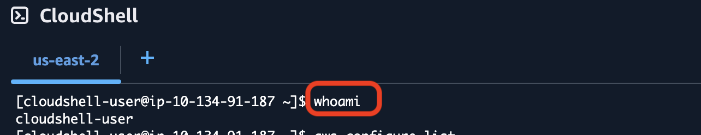

I am making use of AWS CLI interface to deliver this project.

Run the `aws configure list` command to ensure AWS CLI is properly configured and running on your server.
The below result should be your displayed result.
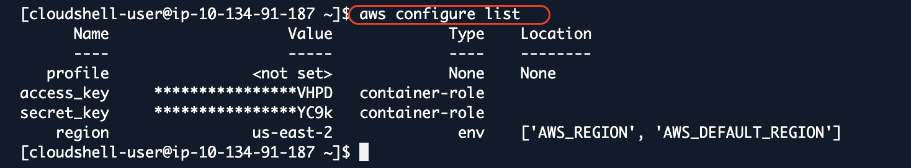.

Now moving on:

## STEPS:
For this project, my  shell script goes with the name **aws_cloud_manager.sh**

1. `nano aws_cloud_manager.sh`
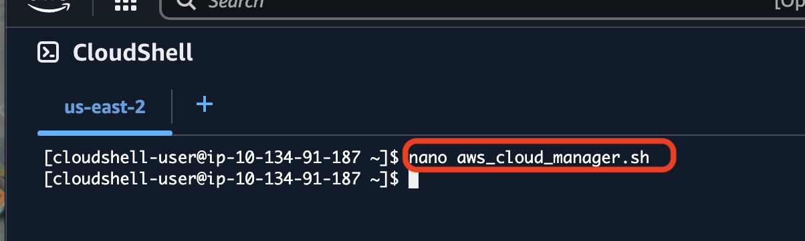

2. Here I have the main function of the script for my **aws_cloud_manager** file.

- Script Enhancement  
-  Define IAM User Names Array  
- Create IAM Users  
-  Create IAM Group  
-  Attach Administrative Policy to Group  
-  Assign Users to Group 

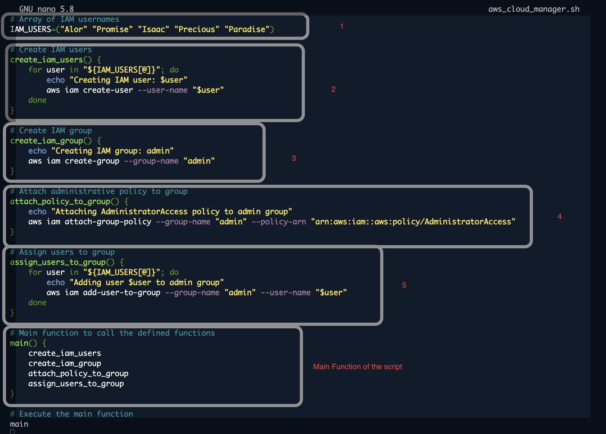
Save and exit the file editor.

3. Run the `ls` command to see the file I have created. 
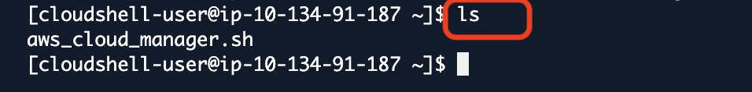

Now, this file isnt executable, hence why it is still in grey color.

4. To make this file executable, I have to run the `chmod +x filename` command. 
For this project, it is `chmod +x aws_cloud_manager.sh`.
Run the `ls` command again to view the file and now, we have the script in an executable format!
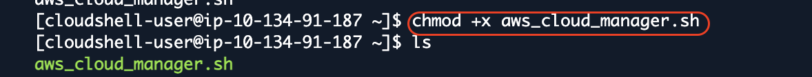

5. Run the script: `./aws_cloud_manager.sh`
Here is my displayed result
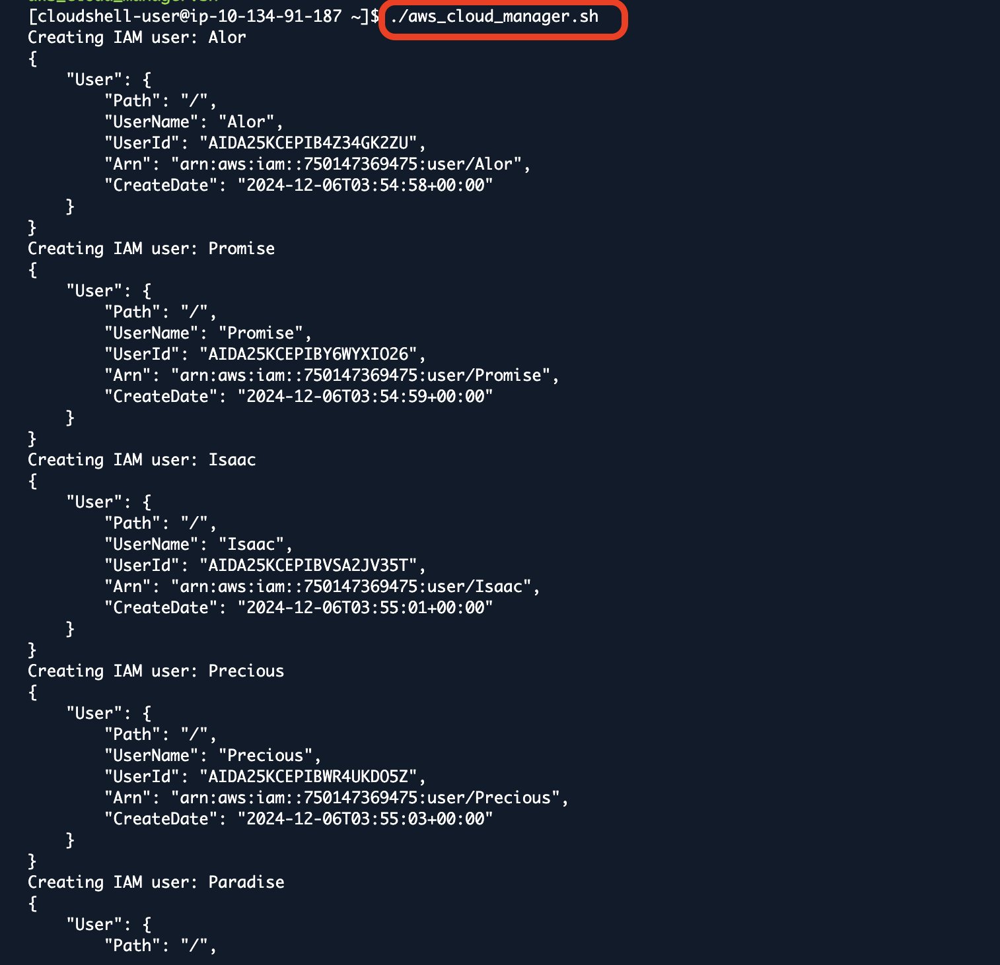
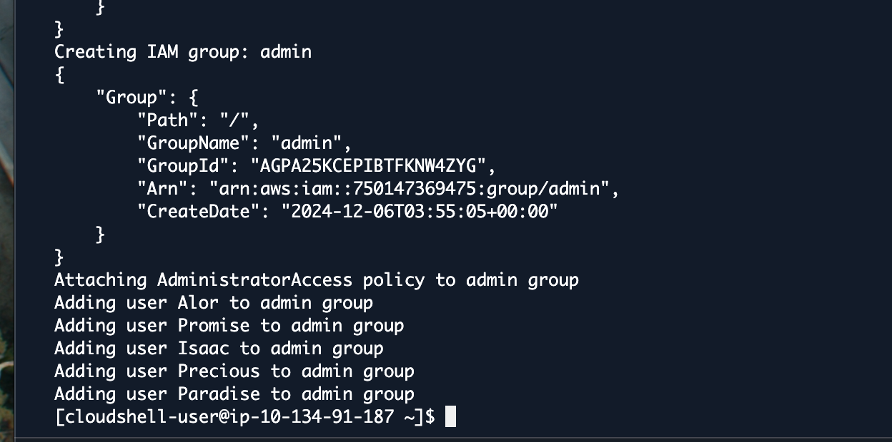
My desired result were all automated!

To confirm these, I logged into my AWS account and here I have my IAM USERS, IAM Group, Administrative Policy attached to Group and also IAM Users attached to IAM GROUP as well.

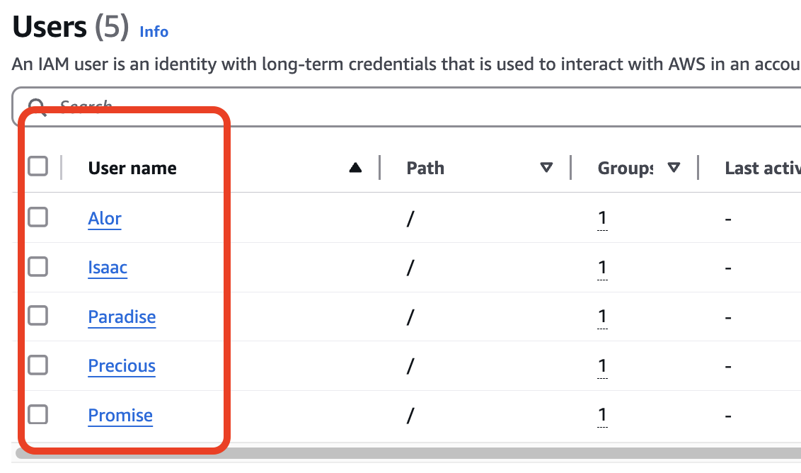
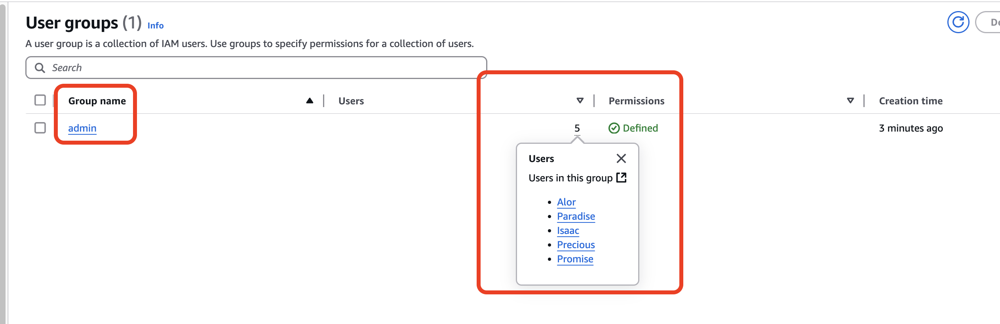
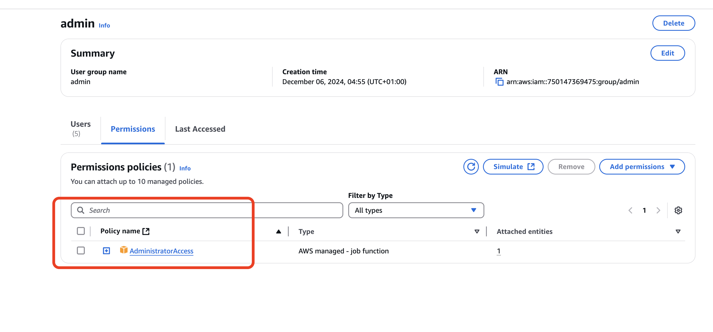

PROJECT HAS BEEN AUTOMATED AND DONE!